**蛋糕店售卖管理系统**

**Readme：**

**这个东西是按标准开发流程完成的，所以下面的内容都是一个正常的软件文档的格式，从需求分析到测试**

**摘要：**信息化的今天，计算机网络、Internet扮演的角色也越来越重要，其核心的数据库技术正在改变着我国各个领域的管理经营模式，而作为街边常见的蛋糕店的管理模式也应该随着时代的发展而变化。管理系统现代化迫在眉睫，一场深层次的变革即将来临。随着信息科学技术的飞速发展，人们逐渐意识到对信息管理系统的运用可以使日常工作更加方便、快捷和高效。论文详细论述了一个基于B/S结构的蛋糕店售卖管理系统的开发设计过程。系统采用Java
作开发平台，MySQL作数据库管理系统，实现了等功能。系统符合蛋糕店管理的要求，能够帮助蛋糕店切实提高销售效率。

论文组织如下：首先阐述了该系统的开发背景、意义；其次介绍了相关的开发工具及技术基础；接着对系统的需求进行了分析，并提出了具体的设计方案和数据库模型；然后展现了整个系统的具体实现，包括数据库的设计和连接，各功能模块的实现。

**关键词：**蛋糕店售卖管理系统、数据库、JAVA

1 引言
======

自从人类进入21世纪,也就进入了一个高速发展的信息时代，高新技术飞速发展的同时,也使得计算机的使用范围大大扩展，它已经涉及到人类生活的方方面面。计算机使用的方便快捷,使它在越来越多的方面显示出比传统人工制作更迅速和准确的优点,尤其是在信息记录,检索和查询方面,更是使我们人类避免了不必要的麻烦。

开发和使用蛋糕店售卖管理系统对于蛋糕店来说是非常必要的，它与传统的实体店售卖相比能加快蛋糕店的信息化步伐，提高蛋糕店的销售水平，包括普通用户和管理员用户的各种操作，增强在同行业中的竞争实力，是现代蛋糕店经营模式与计算机信息技术的必要结合。蛋糕店售卖管理系统能加强蛋糕销售水平，统计日常流水账目，最大限度地提高蛋糕的售卖效率，给蛋糕店带来了显著的经济效益，也能使使用该系统的蛋糕店在未来竞争中处于领先地位。

本课题设计一个蛋糕店售卖管理系统,通过这个系统管理员可以简捷、方便的对各类甜品的进行管理（添加甜品种类、下架甜品）、对消费者购买记录进行查阅、配送、退货以及对客户的账号注销等功能，而客户也可以通过这个系统对甜品的信息查询、购物车增删、购买及填写收货信息等功能。系统采用Java作开发工具，MySQL作数据库管理系统。

2 系统理论基础及开发工具简介
============================

2.1 B/S结构
-----------

### 2.1.1 什么是B/S结构

B/S(Client/Server)结构，即大家熟知的“客户机和服务器”结构，它是软件系统体系结构，通过它可以充分利用两端硬件环境的优势，将任务合理分配到Client端和Server端来实现，降低了系统的通讯开销。

### 2.1.2 B/S架构软件的优势与劣势

（1）应用服务器运行数据负荷较轻。最简单的B/S体系结构的数据库应用由两部分组成，即客户应用程序和数据库服务器程序，二者可分别称为前台程序与后台程序。运行数据库服务器程序的机器，也称为应用服务器。一旦服务器程序被启动，就随时等待响应客户程序发来的请求；客户应用程序运行在用户自己的电脑上，对应于数据库服务器，可称为客户电脑，当需要对数据库中的数据进行任何操作时，客户程序就自动地寻找服务器程序，并向其发出请求，服务器程序根据预定的规则作出应答，送回结果，应用服务器运行数据负荷较轻。

（2）数据的储存管理功能较为透明。在数据库应用中，数据的储存管理功能，是由服务器程序和客户应用程序分别独立进行的，前台应用可以违反的规则，并且通常把那些不同的运行数据在服务器程序中不集中实现，例如访问者的权限、编号可以重复、必须有客户才能建立定单这样的规则。所有这些，对于工作在前台程序上的最终用户，是“透明”的，他们无须过问(通常也无法干涉)背后的过程，就可以完成自己的一切工作。在客户服务器架构的应用中，前台程序不是非常“瘦小”，麻烦的事情都交给了服务器和网络。在B/S体系的下，数据库不能真正成为公共、专业化的仓库，它受到独立的专门管理。

（3）B/S架构的劣势是高昂的维护成本且投资大。首先，采用B/S架构，要选择适当的数据库平台来实现数据库数据的真正“统一”，使分布于两地的数据同步完全交由数据库系统去管理，但逻辑上两地的操作者要直接访问同一个数据库才能有效实现，有这样一些问题，如果需要建立“实时”的数据同步，就必须在两地间建立实时的通讯连接，保持两地的数据库服务器在线运行，网络管理工作人员既要对服务器维护管理，又要对客户端维护和管理，这需要高昂的投资和复杂的技术支持，维护成本很高，维护任务量大。其次，传统的B/S结构的软件需要针对不同的操作系统系统开发不同版本的软件，由于产品的更新换代十分快，代价高和低效率已经不适应工作需要。

2.2 Java的介绍
--------------

Java是一种由微软公司开发的包含协助开发环境的事件驱动编程语言。从任何标准来说，JAVA都是世界上使用人数最多的语言——不仅是盛赞JAVA的开发者还是抱怨JAVA的开发者的数量。它源自于BASIC编程语言。JAVA拥有图形用户界面（GUI）和快速应用程序开发（RAD）系统，可以轻易的使用DAO、RDO、ADO连接数据库，或者轻松的创建ActiveX控件。程序员可以轻松的使用JAVA提供的组件快速建立一个应用程序。

窗体控件的增加和改变可以用拖放技术实现。一个排列满控件的工具箱用来显示可用控件（比如文本框或者按钮）。每个控件都有自己的属性和事件。默认的的属性值会在控件创建的时候提供，但是程序员也可以进行更改。很多的属性值可以在运行时候随着用户的动作和修改进行改动，这样就形成了一个动态的程序。举个例子来说：窗体的大小改变事件中加入了可以改变控件位置的代码，在运行时候每当用户更改窗口大小，控件也会随之改变位置。在文本框中的文字改变事件中加入相应的代码，程序就能够在文字输入的时候自动翻译或者阻止某些字符的输入。

JAVA的程序可以包含一个或多个窗体，或者是一个主窗体和多个子窗体，类似于操作系统的样子。有很少功能的对话框窗口（比如没有最大化和最小化按钮的窗体）可以用来提供弹出功能。JAVA的组件既可以拥有用户界面，也可以没有。这样一来服务器端程序就可以处理增加的模块。

2.3 MySQL简介
-------------

MySQL是一个关系数据库管理系统，是Microsoft推出新一代数据管理与分析软件。MySQL是一个全面的、集成的、端到端的数据解决方案，它为企业中的用户提供了一个安全、可靠和高效的平台用于企业数据管理和商业智能应用。

MySQL是一个全面的、集成的、端到端的数据解决方案，它为企业中的用户提供了一个安全、可靠和高效的平台用于企业数据管理和商业智能应用。MySQL为IT专家和信息工作者带来了强大的、熟悉的工具，同时减少了在从移动设备到企业数据系统的多平台上创建、部署、管理及使用企业数据和分析应用程序的复杂度。通过全面的功能集、和现有系统的集成性、以及对日常任务的自动化管理能力，MySQL为不同规模的企业提供了一个完整的数据解决方案。

MySQL数据平台包括如下工具：关系型数据库、复制服务、通知服务、集成服务、分析服务、报表服务、管理工具、开发工具。

MySQL数据平台为不同规模的组织提供了如下好处：充分利用数据资产、提高生产力、减少IT复杂度、更低的总体拥有成本(TCO)。

3 系统需求分析与方案设计
========================

3.1 需求分析
------------

计算机技术改造蛋糕店的传统管理方式，由原始经验型管理向科学型管理的转化，是替代重复性繁重的脑力劳动的过程。只有使用计算机及信息化管理手段方能实现管理的标准化、规范化、制度化和科学化，并能排除人为干预，同时能够充分地节约蛋糕店日常工作中不必要的浪费和开支。另外蛋糕售卖管理计算机化也能够使各个环节工作有机衔接，方便客户订单的统计分析。通过信息化管理，提高蛋糕店的管理水平；
提高员工的工作效率； 方便客户了解甜品各方面的信息； 保证了售卖过程的准确性；
保证了甜品及时调价，实现了甜品及时准确盘存核算、各甜品的分类统计，订单、配送、结算等各个环节均由计算机代替，其效率远远超过人工。利用规范严格的程序设计和先进的硬技术相结合，杜绝了人为因素造成损失，形成了一个以客户为中心的甜品售卖系统。

通过对用户需求的分析，要求本系统具有以下功能:

(1)
由于一项新的软件在被使用之前，对于使用者来说是陌生和崭新的，所以要求系统具有良好的人机界面；

(2) 原始数据修改简单方便，在系统的使用过程中支持多条件查询；

(3) 数据计算自动完成,数据的稳定性和可靠性好，尽量减少人工干预。

3.2 方案设计
------------

具体说来，要求本系统具有以下两个主要模块：

系统整体模块图如图1所示

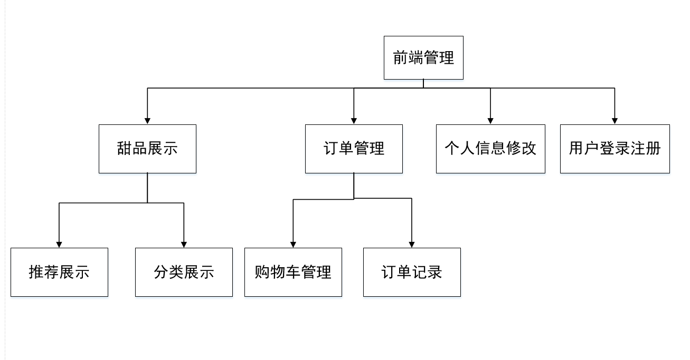

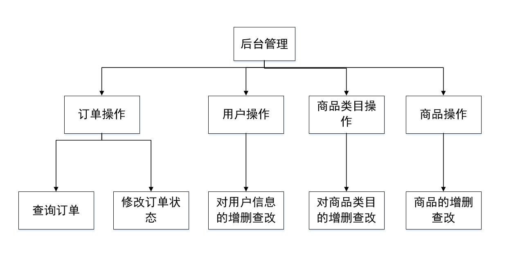

各模块具体的需求描述如下:

**前端管理：**

(1)甜品展示：

客户可以看甜品推荐展示，及分类展示

(2)个人信息修改：

客户可以对自己的收货人、收货地址、收货电话进行自定义修改

(3)用户登录注册：

客户进行自助注册，所需信息包含：用户名、邮箱、密码、收货人、收货地址、收货电话

(4)：订单管理

客户可以对自己的购物车进行管理，和查看订单记录。

**后台管理:**

(1)订单操作：

管理员可以查询订单，并且可以修改订单状态

(2)用户操作：

管理员可以对用户信息的增删改查

(3)商品类目操作：

管理员可以对商品类目的增删改查

(4)：商品操作：

管理员可以对商品的增删改查

3.3 销售业务流程分析
--------------------

系统业务流程图（Transaction Flow
Diagram,简称TFD），就是用一些规定的符号及连接来表示某个具有的业务处理过程。我们采用以下规定符号。

人员 单位 文档、单据

业务流程分析可以帮助用户了解该业务的具体处理过程，发现和处理系统工作中的错误和疏漏，修改和删除业务中的不合理部分利用系统调查的资料将业务处理过程中的每一步用一完整的图形将其串起来。

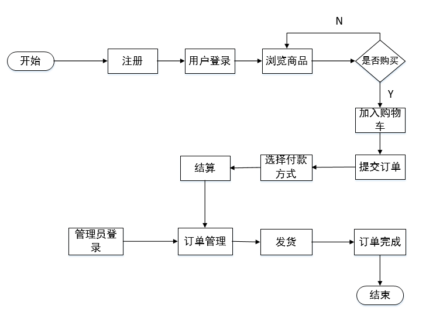

3.4 数据流程分析
----------------

数据流程图是一种能够全面地描述信息系统逻辑模型的主要工具，利用极少的符号综合的反映出信息在系统中的流动、处理和储存情况。我们采用以下规定符号。

外部实体 处理（功能） 数据流 数据储存

### 3.4.1 客户购买数据流程分析

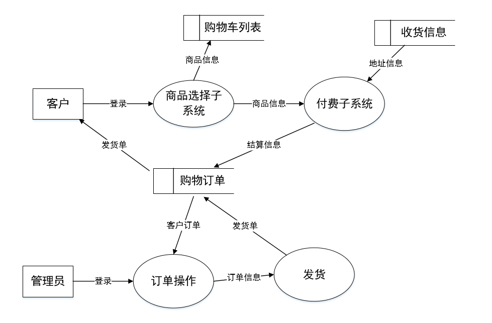

### 3.4.2用户管理数据流分析

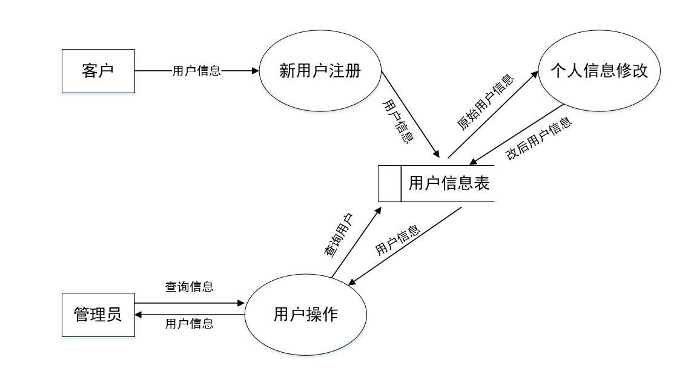

3.5 可行性研究
--------------

### 3.5.1 技术可行性

本系统利用Java作为系统的开发工具，是因为它采用面向对象的编程方法——把程序和数据封装起来作为一个对象，并为每个对象赋予相应的属性；事件驱动的编程机制——通过事件执行对象的操作，在设计应用程序时，不必建立具有明显的开始和结束的程序，而是编写若干个过程，通过这些过程执行指定的操作；提供完善的指令控制语句，给开发高性能的系统提供了保障，保证了代码的模块化要求。

系统采用MySQL作为后台数据库，它可以通过窗体提供的工具输入数据到数据库，可以使用查询设计和结构查询语言实现查询。特别是身边的同学的帮助，使得在开发过程中所遇到的困难都

能够一一得到解决。

### 3.5.2 经济可行性

随着计算机的大量普及，其价格已经越来越被众多的单位和人所接受，然而价格的低廉并不意味着性能上的退化，相反，随着科学技术的发展，计算机随着价格的降低，性能却日渐提高。本系统的开发，在已经使用了计算机进行管理的售卖系统中无疑会受到欢迎，它会给蛋糕店的工作效率带来一个质的飞跃，其主要的优点主要表现在它可以作为蛋糕店售卖管理系统基本功能的一个缩影，集成了订单管理、用户自我注册登录和信息等多种功能，具有较强的实用性和先进性。

由于本系统具有安全性上面的保护措施，只有用户拥有了系统合法的用户名和相应的密码之后，才能进入系统，对系统的对应信息进行添加、修改和删除，其他非合法的用户都不能进入系统，这样，使得该项目在处理信息方面更加保密。

### 3.5.3 操作可行性

由于本系统管理的对象比较单一，且每个数据库内容具有较强的关联性，设计的过程不是很复杂，因此，比较适合于采用数据库管理。且因为本系统所耗费的资源非常小，故一般工作中使用的微机无论在软件上还是硬件上都可以满足运行要求。

### 3.5.4 社会可行性

最重要的一点还是在社会可行性方面。因为目前在我国大部分蛋糕店，没有使用计算机管理系统，信息处理基本上还处于手工状态，致使管理员劳动强度大且工作效率低，所以一个好的有效的计算机管理系统的出台是十分必要的，而在信息化发展的今天，想要提高竞争力，使用计算机管理系统已经成为一种趋势。而该系统地提出正是顺应了这种潮流，再加上以上的三点优势：低廉的价格，良好的可扩充性，方便的管理。相信该计算机管理系统一定会在未来的运用中大放光彩。

4 系统的实现
============

4.1 数据库的构建
----------------

### 4.1.1 商品表

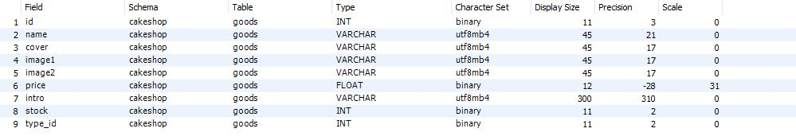

此表包括了商品的编号、名称、介绍、商品图片、类目、价格、数量等属性。

### 4.1.2 管理员表

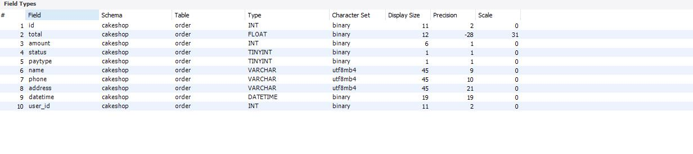

此表体现了管理员的ID、职位、姓名、电话、地址、上线时间。管理员表继承了用户表的所有属性。

### 4.1.3 商品管理表

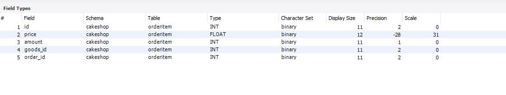

### 4.1.4 订单表

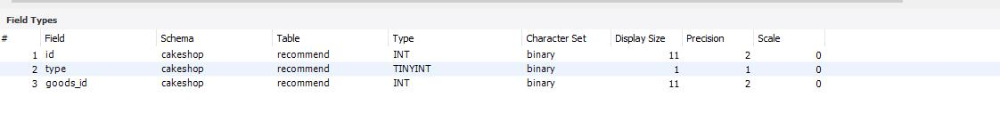

此表是为了实现蛋糕店售卖管理系统对于订单的发货和删除的管理。

### 4.1.5 分类名表

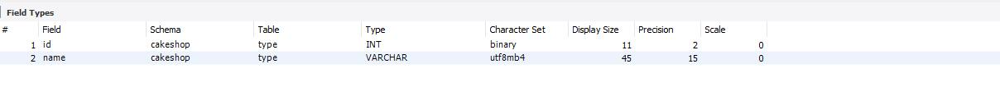

### 4.1.6 用户表

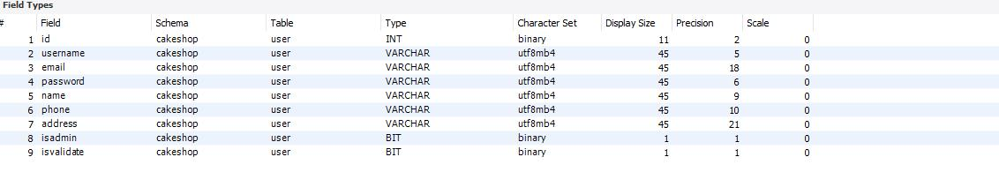

用于存储用户的ID及用户名、email、密码，收货人姓名、电话、收货地址等。

4.2 系统详细设计
----------------

### 4.2.1 注册登录界面

这是整个系统的第一个界面，注册界面：

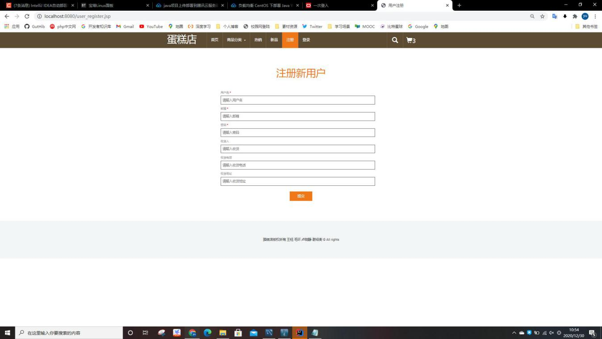

通过输入用户名和密码，进入到下一个界面（依据所登录用户名进行权限分配）：

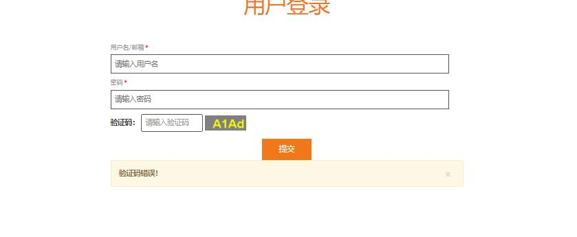

### 4.2.2 系统首页

顶部菜单栏,总体以翻页方式来展示商品缩略图,如下图所示:

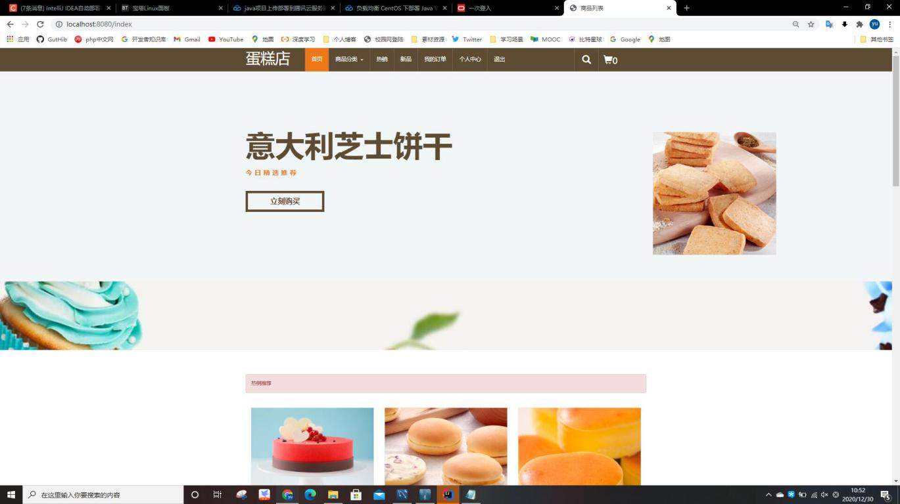

### 4.2.3 商品分类

这里以小菜单的形式展示所有的甜品分类,如下图所示:

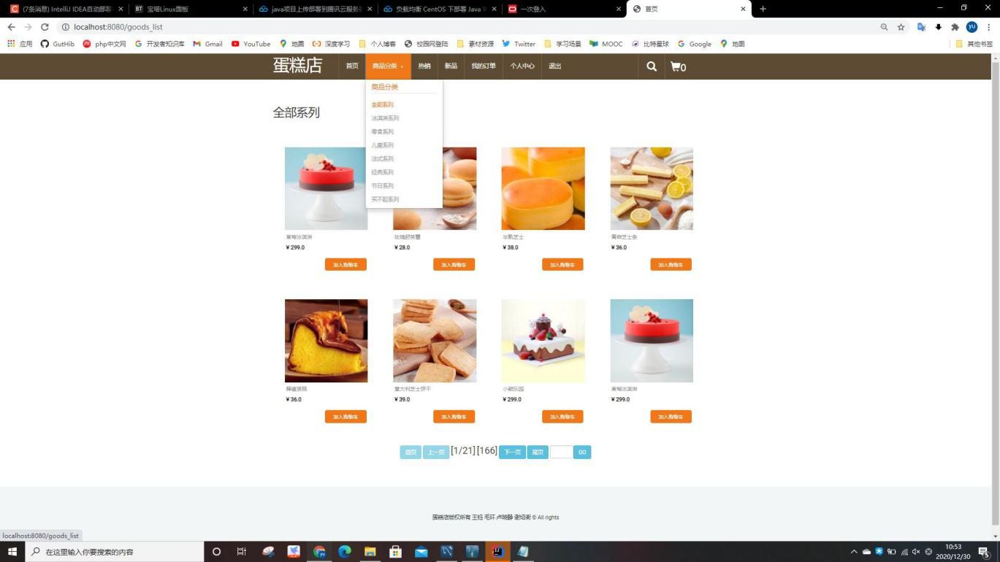

### 4.2.6我的订单

对加购支付的订单状态，可以在我的订单菜单项查看，订单状态以表格的形式体现，如下图所示：

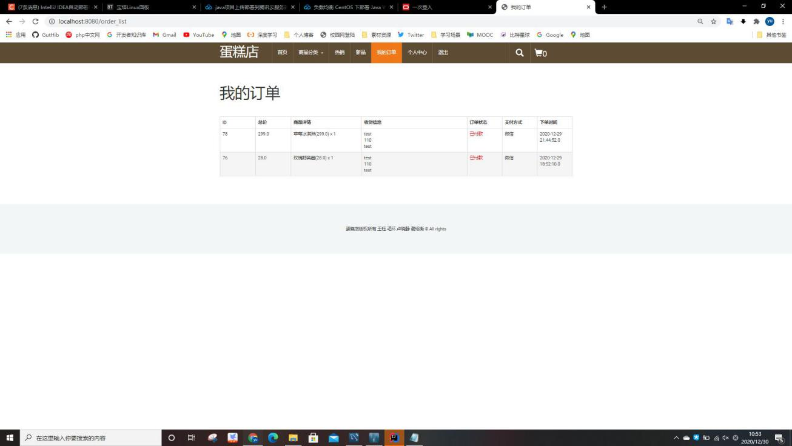

### 4.2.7 客户购物车管理

客户登录界面中的购物车界面，包括对商品数量的增加减少和删除，以及提交订单给管理员，如下图所示：

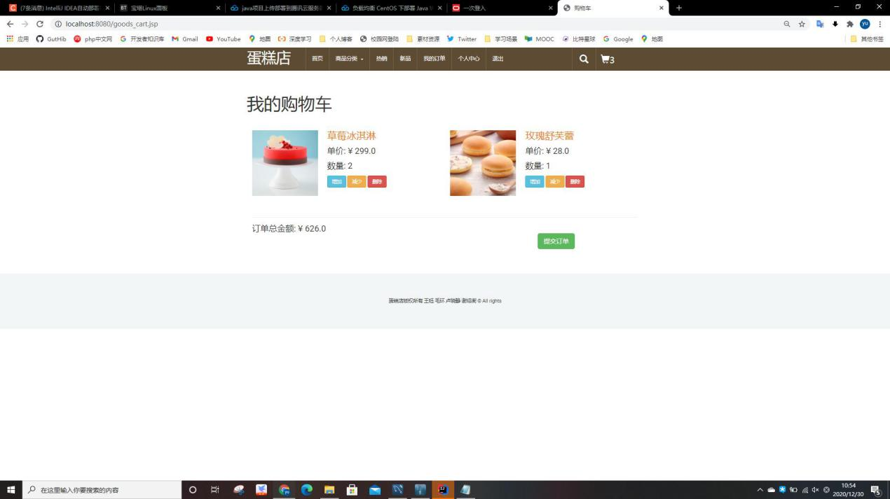

### 4.2.8客户个人信息修改

分为修改收货信息及更改密码，修改好信息点击提交即可，如下图所示：

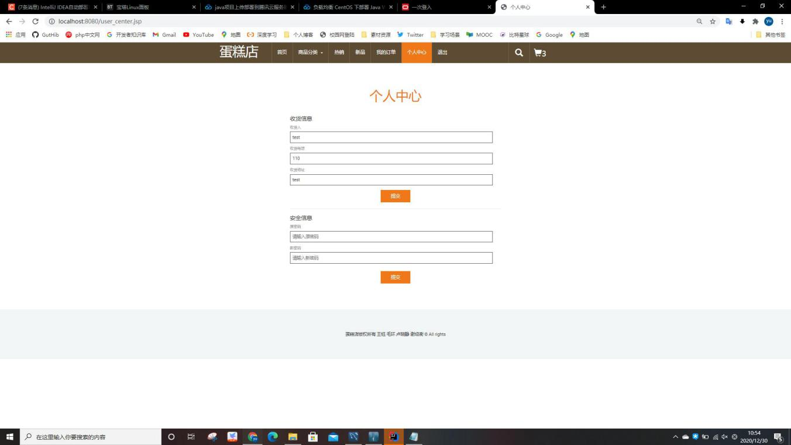

### 4.2.9 管理员订单管理

管理员对客户所提交订单进行处理包括发货和删除，如下图所示：

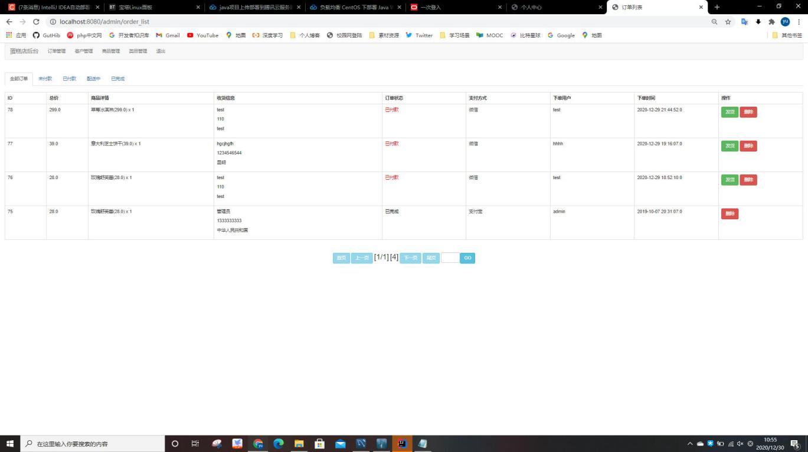

### 4.2.10 管理员对用户管理

管理员对各用户进行操作包括重置密码、修改、删除，如下图所示：

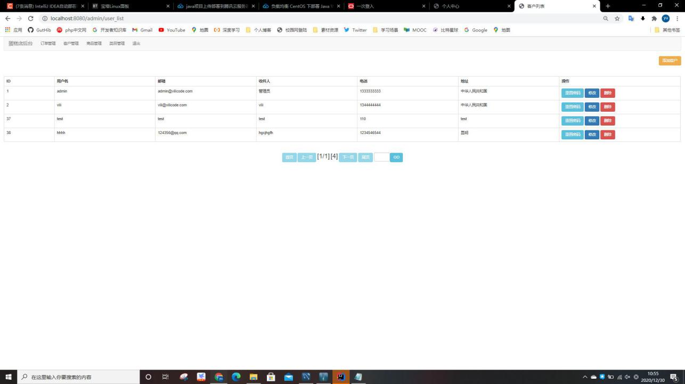

### 4.2.11 后台商品管理

这里以列表的形式按分类展示所有的商品信息，可以对商品进行加入条幅、移出热销、加入新品、修改商品信息、删除商品等操作，具体情况如下图所示：

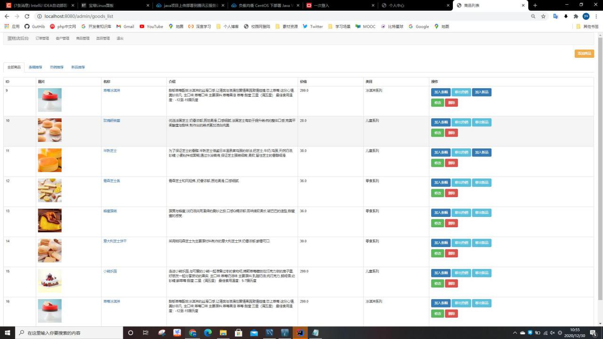

### 4.2.12 用户管理

这里以列表的形式展示所有的用户信息，如下图所示：

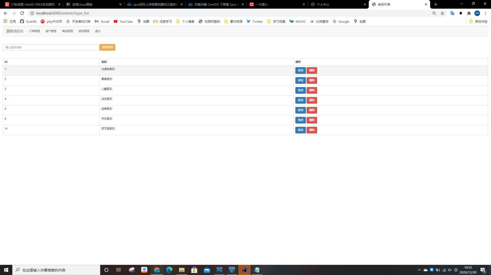

5 项目测试
==========

（1）代码飘红是因为Tomcat未加入到代码检查的环境，但加入到了编译环境，所以代码在IDEA里会出现错误，但可以正常运行，因为不影响运行，我们也没有深入解决这个问题，所以代码界面不太美观，

（2）数据库MySQL8.16之后的版本与之前的版本驱动名不同，我们使用的是MySQL8.19,在数据库驱动连接时出现了问题。

6 结论
======

本毕业设计的题目是基于B/S结构蛋糕店售卖管理系统，用Java作为开发工具，MySql最为后台数据库，实现了蛋糕店的基本功能，包括前台登录、下单以及加入购物车等功能，后台管理员包括商品的添加删除，分类的添加删除，以及用户的管理等功能。开发过程中遇到了一些错误，首先是数据库连接的时候，应为我们使用的数据库是比较新的版本，mysql\_8.19，然后新版的数据库驱动与旧版本的数据库驱动有差别，在多次查阅网上资料后，更改了数据库链接文件中驱动配置，数据库基本得到了解决。由于本系统的开发使用了java
1.8并配以idea作为开发工具,具有可视化的编程环境,在编程的过程中就可以对所做的结果进行运行,以立即进行改正。功能上还存在一些问题，很多模块的功能并没有真正的实现，例如用户下单支付功能，只是实现图片选择的功能，并没有真正的对接到第三方支付的API。后期工作，应当进一步合理规划系统内部逻辑拓扑，调整模块的设计及功能的实现，更加符合现实运作情况。

致 谢

蛋糕店售卖管理系统的好处是可以简化人们日常工作中的大量机械重复的操作，使一些过程繁琐且数据量大的数据收集工作得以高效的进行。

经过近段时间的努力，我们最终完成了蛋糕店售卖管理系统课程设计报告。和传统管理方式相比，使用本系统，毫无疑问会大大提高整个蛋糕店的运作效率，辅助提高管理员的决策水平，管理水平，降低经验成本，提高效率，减少差错，节省人力，减少中间时间，提高客户的满意度，增强蛋糕店扩张能力，提供有效的技术保证。但由于开发者能力有限，加上时间仓促，本系统难免会出现一些不足之处。希望老师批评指正。

参考文献

[1] 陆慧恩.软件工程[M].北京:人民邮电出版社,2007

[2] 王少峰.面向对象技术UML教程[M].北京:清华大学出版社,2004

[3] 钱哨,李挥剑,李继哲.JAVA WinForm 实践开发教程[M].北京:水利水电出版社,2010

[4] 蒋瀚洋,李月军,庞娅娟.MySql数据库管理与开发教程[M].北京:人民邮电出版社,2010

[5] 萨师煊,王珊.数据库系统概论[M].北京：高等教育出版社,2005

待完成功能：

1）、计划用redis实现购物车功能，但还未实施
